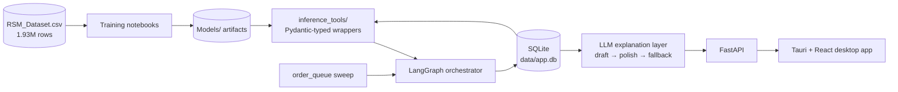
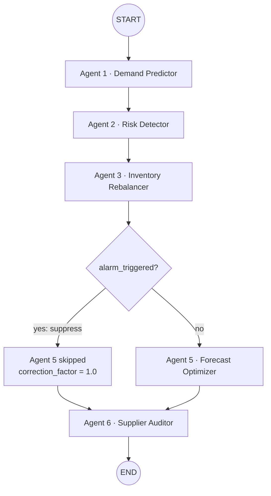

# Agentic AI for Supply Chain Management

An agentic supply-chain system that chains **five independently trained ML models** into one **LangGraph** pipeline, persists every decision in a constraint-enforcing **SQLite** database, and explains results through a **fact-grounded cloud LLM** layer. A **FastAPI** backend serves a **Tauri + React** desktop app.

> **Core idea: a database-enforced safety invariant.** If the Risk Detector raises a backorder alarm for a SKU, the Forecast Optimizer is not allowed to reduce that SKU's forecast. This is enforced in the orchestrator **and** by a SQL `CHECK` constraint, so a future bug in the Python code cannot write a violating row.

---

## Architecture



Each layer depends only on the one below it. The frontend talks to the API contract only, so retraining a model needs no frontend change.

## The pipeline



Agent numbering skips 4: a "Routing" agent was designed and then cancelled, and its number was deliberately never reused.

| Agent | Model | Output | Headline result |
|---|---|---|---|
| 1 · Demand Predictor | LightGBM log-ratio regressor with Duan smearing | 6-month demand forecast | Bit-exact parity with the training notebook (0.0 diff on 1,750 test rows) |
| 2 · Risk Detector | Stacking ensemble (XGBoost, CatBoost, LightGBM, LogReg) | Backorder probability and alarm flag | ROC-AUC **0.9655**, F2 **0.4473** at an F2-tuned threshold of 0.945 |
| 3 · Inventory Rebalancer | XGBoost regressor | Urgency score (0–1), recommended quantity | Spearman ρ **0.9764** vs 0.1239 for a linear baseline |
| 5 · Forecast Optimizer | Bias classifier plus correction-factor regressor | Corrected forecast, recommendation | MAPE **1771 → 723** on the 3-month forecast |
| 6 · Supplier Auditor | XGBoost classifier with sklearn preprocessing | Grade A–D, stop-auto-buy flag | ROC-AUC **0.98**, MCC **0.76** |

Every pipeline run stamps a SHA-256 manifest of the model artifacts into `pipeline_runs.manifest_version`, so each prediction traces back to the exact model files that produced it.

## LLM explanations

Explanations are **draft-first**. A deterministic draft is built from real run data and a documented grounding table, so it is always a complete, correct answer. The LLM (via OpenRouter) only polishes the prose and is instructed never to add or change a fact. If the API fails, is rate-limited, or has no key, the system returns the draft with HTTP 200. Results are cached per `(run_id, agent_name)`, and explanations are generated on demand, never inside the pipeline.

## Tech stack

| Layer | Technology |
|---|---|
| ML | pandas, scikit-learn, XGBoost, LightGBM, CatBoost, imbalanced-learn |
| Inference | Pydantic 2 typed I/O |
| Orchestration | LangGraph |
| Database | SQLite, SQLAlchemy 2.0 (WAL, enforced foreign keys) |
| API | FastAPI, Uvicorn |
| LLM | OpenRouter over httpx |
| Frontend | Tauri 2, React 19, TypeScript, Vite 7 |
| Tests | pytest |

## Repository layout

```
inference_tools/   Pydantic-typed model wrappers (no LangGraph/LLM imports)
src/
  orchestrator/    LangGraph graph, nodes, suppression edge, manifest, tracing
  db/              SQLAlchemy models, create/verify/seed scripts
  repository/      Pipeline persistence service
  queue/           order_queue ingestion and 7-day sweep
  llm/             Grounding, draft builder, OpenRouter client, explainer
  api/             FastAPI app and routers
frontend/          Tauri + React desktop app
scripts/           CLI tools (run_sweep, add_new_sku, run_single_prediction, ...)
audits/            CSV data-quality audit and reports
Notebooks/         Model training notebooks
Models/            Trained artifacts and metrics
tests/             pytest suites
features.py        Serve-time feature engineering
```

## Getting started

### Prerequisites
- Python 3.10+ (developed on 3.14)
- Node.js 18+ and Rust (only for the desktop app)
- [Git LFS](https://git-lfs.com/), because `*.pkl` model files are stored with LFS
- An [OpenRouter](https://openrouter.ai/) API key (optional for the pipeline, required to start the API)

### 1. Install

```bash
git clone https://github.com/ashrafi007/Supply-Chain-Management-System-By-Agentic-AI-with-LLM-reasoning.git
cd Supply-Chain-Management-System-By-Agentic-AI-with-LLM-reasoning
git lfs pull

python3 -m venv venv
source venv/bin/activate
pip install -r requirements.txt
```

### 2. Configure

```bash
cp .env.example .env
# set OPENROUTER_API_KEY in .env
```

### 3. Data and model files

The raw dataset (`Dataset/RSM_Dataset.csv`) and large model artifacts (`*.pkl`, `*.joblib`) are git-ignored and are not in the repository. Place them at the paths used by the wrappers before running inference. Without the model files, the inference tools and pipeline cannot load.

### 4. Create the database

```bash
python -m src.db.create_db
python -m src.db.verify_db   # also proves the CHECK constraints reject bad rows
```

### 5. Run

```bash
# Process the due order_queue (add --no-explain to skip LLM explanations)
python -m scripts.run_sweep

# Add a new SKU interactively (raw features in, engineered features derived at serve time)
python -m scripts.add_new_sku

# Start the API
uvicorn src.api.main:app --reload

# Start the desktop app (separate terminal)
cd frontend && npm install && npm run tauri dev
```

### 6. Test

```bash
python -m pytest -q
```

## API

| Endpoint | Purpose |
|---|---|
| `GET /runs`, `GET /runs/{run_id}` | Pipeline runs with predictions and per-agent traces |
| `POST /predictions/{run_id}/explain` | On-demand LLM explanation (optional `?agent_name=`) |
| `/skus`, `/suppliers` | SKU and supplier management |
| `/queue` | Order queue: add, sweep, delete (all deletions audited) |

Interactive docs are at `http://127.0.0.1:8000/docs` once the server is running.

## Engineering principles

- **Predictor/reasoner separation.** Inference tools contain only model code. Orchestration lives one layer up.
- **No hidden coupling.** Agents 3 and 5 take Agent 2's outputs as required inputs from the orchestrator and never load its model.
- **Fail loud, fail early.** Model artifacts are validated at startup, and the API refuses to start without its key.
- **Constraints at the lowest layer.** The suppression rule and the urgency range are SQL `CHECK` constraints.
- **Never fake a number.** Fields that can't be computed honestly are `null`, not approximated.
- **Documented gaps over silent guesses.**

## Known limitations

- The Supplier Auditor grades about 91% of SKUs "D" because its `stop_auto_buy` label is 96% positive. The label's meaning is under review before a retrain.
- `demand_velocity_band` and `stockout_risk` exist in the notebook but are not yet in the production Demand Predictor wrapper.
- Agent 5 keeps two features (`forecast_accuracy_gap`, `inv_depletion_rate`) that may leak target information. This is flagged for follow-up.
- The database uses `create_all()` with no migrations yet. Alembic is a planned next step.
- The queue sweep is run manually and is not yet scheduled.

## License

No license has been specified yet. Add a `LICENSE` file before accepting contributions.
